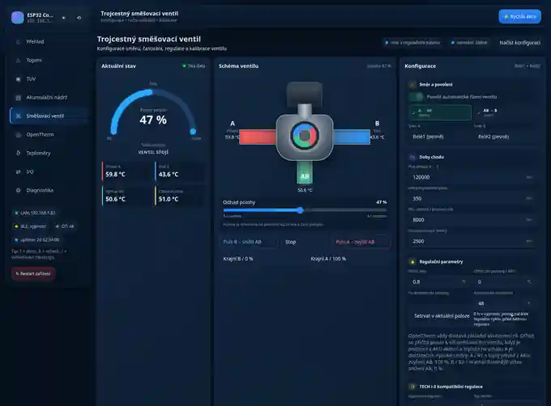
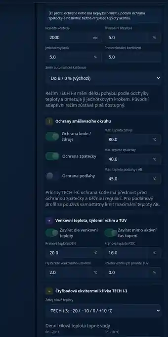

# ESP32-S3-ETH-8DI-8RO Heat Controller

Firmware pro řízení topné soustavy na desce **Waveshare ESP32-S3-ETH-8DI-8RO** s podporou **OpenTherm**, **DS18B20**, ekvitermní regulace a řízení trojcestného směšovacího ventilu.

**Aktuální dokumentovaná verze: 3.5.1**  
**Nově:** volitelný regulační režim směšovacího ventilu podle principů **TECH EU-i-3 / i-3**.

> [!WARNING]
> Firmware ovládá kotel, servopohon směšovacího ventilu, relé a další prvky topné soustavy. Před automatickým provozem vždy ověřte skutečný směr pohybu ventilu, přiřazení relé, umístění teplotních čidel a bezpečné krajní polohy. Software nenahrazuje havarijní termostaty, pojistné ventily, tlakové ochrany ani další nezávislé bezpečnostní prvky.

## Obsah

- [Co umí verze 3.5.1](#co-umí-verze-351)
- [Hardware](#hardware)
- [Pevné GPIO mapování](#pevné-gpio-mapování)
- [Relé a směšovací ventil](#relé-a-směšovací-ventil)
- [Teplotní zdroje](#teplotní-zdroje)
- [Režimy směšovacího ventilu](#režimy-směšovacího-ventilu)
- [TECH i-3 kompatibilní regulace](#tech-i-3-kompatibilní-regulace)
- [Ekvitermní regulace](#ekvitermní-regulace)
- [Ochranné priority](#ochranné-priority)
- [TUV a cirkulace](#tuv-a-cirkulace)
- [OpenTherm](#opentherm)
- [Síť, MQTT a Home Assistant](#síť-mqtt-a-home-assistant)
- [Webové rozhraní](#webové-rozhraní)
- [Konfigurace a ukládání](#konfigurace-a-ukládání)
- [Kompilace a nahrání](#kompilace-a-nahrání)
- [Doporučený první start](#doporučený-první-start)
- [Diagnostika](#diagnostika)
- [Omezení](#omezení)

## Co umí verze 3.5.1

Projekt kombinuje:

- řízení kotle přes OpenTherm,
- ekvitermní výpočet cílové teploty topné vody,
- původní adaptivní regulaci směšovacího ventilu,
- nový volitelný režim `tech_i3`,
- profily ventilu `ch`, `floor`, `return_protection`, `pool` a `ventilation`,
- ochranu kotle / zdroje proti přehřátí,
- ochranu nízké teploty zpátečky,
- ochranu maximální teploty podlahového okruhu,
- proporcionální krokování směšovacího ventilu,
- volitelný směr otevírání servopohonu bez přepojení R1/R2,
- automatickou kalibraci TECH i-3 každých 48 hodin,
- samostatný týdenní program úplného zavření po 30 minutách,
- týdenní hodinovou korekci cíle ventilu v rozsahu ±20 °C,
- minimální otevření ventilu,
- volitelnou čtyřbodovou ekvitermní křivku `-20 / -10 / 0 / +10 °C`,
- denní a noční režim a týdenní plán,
- letní režim,
- prioritní ohřev TUV,
- cirkulaci TUV,
- anti-legionella režim,
- až čtyři OneWire sběrnice DS18B20,
- Wi-Fi a W5500 Ethernet,
- BLE zdroj venkovní teploty,
- MQTT telemetrii a Home Assistant Discovery,
- OTA a webovou aktualizaci firmware / LittleFS,
- moderní webové UI s WebSocket aktualizacemi,
- front-end/back-end Průvodce nastavením zařízení,
- servisní diagnostiku relé, vstupů, OpenTherm, teplot, MQTT a systému.

Původní regulační algoritmus zůstává zachován. Po aktualizaci se automaticky nepřepíná na nový způsob řízení:

```text
mixing.controlMode = adaptive   # původní chování
mixing.controlMode = tech_i3    # nový TECH i-3 kompatibilní režim
```

## Hardware

Cílová deska:

- **Waveshare ESP32-S3-ETH-8DI-8RO**
- ESP32-S3
- 8 digitálních vstupů
- 8 relé přes TCA9554
- W5500 Ethernet
- Wi-Fi
- I²C
- WS2812 RGB LED
- bzučák
- GPIO0 až GPIO3 pro OneWire / DS18B20

Projekt používá Arduino-ESP32 **3.x**. W5500 implementace využívá API dostupné v této řadě core.

## Pevné GPIO mapování

| Funkce | GPIO |
|---|---:|
| DS18B20 sběrnice 1 | 0 |
| DS18B20 sběrnice 2 | 1 |
| DS18B20 sběrnice 3 | 2 |
| DS18B20 sběrnice 4 | 3 |
| IN1 | 4 |
| IN2 | 5 |
| IN3 | 6 |
| IN4 | 7 |
| IN5 | 8 |
| IN6 | 9 |
| IN7 | 10 |
| IN8 | 11 |
| W5500 INT | 12 |
| W5500 MOSI | 13 |
| W5500 MISO | 14 |
| W5500 SCK | 15 |
| W5500 CS | 16 |
| RGB LED | 38 |
| I²C SCL | 41 |
| I²C SDA | 42 |
| Bzučák | 46 |
| OpenTherm TX | 47 |
| OpenTherm RX | 48 |

### Doporučené rozdělení DS18B20

| GPIO | Výchozí použití |
|---:|---|
| GPIO0 | venkovní teplota / volitelný zdroj |
| GPIO1 | zpátečka cirkulace TUV |
| GPIO2 | zpátečka topného okruhu / port B |
| GPIO3 | akumulační nádrž: horní / střední / spodní čidlo |

Konkrétní ROM adresy DS18B20 lze přiřadit k rolím a uložit do NVS.

## Relé a směšovací ventil

Výchozí mapování:

| Relé | Funkce |
|---|---|
| R1 | směšovací ventil směr A / teplejší větev / zvýšení AB / 100 % |
| R2 | směšovací ventil směr B / chladnější větev / snížení AB / 0 % |
| R3 | přepínací ventil TUV / CH |
| R4 | cirkulační čerpadlo TUV |
| R5 | požadavek TUV na kotel |
| R6 | volitelný DEN / NOC vstup kotle |
| R7 | omezení výkonu kotle |
| R8 | stykač elektrické topné tyče AKU |

R1 a R2 jsou vzájemně blokované v `RelayController`. Firmware nemá úmyslně sepnout oba směry současně.

> [!IMPORTANT]
> Před zapnutím automatické regulace proveďte ruční puls R1 a R2. R1 musí fyzicky zvyšovat teplotu na smíšeném výstupu AB a R2 ji musí snižovat. Nespoléhejte pouze na názvy relé v UI.

## Teplotní zdroje

`TemperatureManager` sjednocuje teploty z OpenTherm, DS18B20 a BLE do logických rolí.

Základní role:

| Role | Typický zdroj |
|---|---|
| `flow` | teplota zdroje / CH z OpenTherm |
| `return` | OpenTherm nebo DS18B20 |
| `dhw_tank` | TUV z OpenTherm |
| `outside` | OpenTherm → DS18B20 → BLE |
| `tank_top` | DS18B20 GPIO3 |
| `tank_mid` | DS18B20 GPIO3 |
| `tank_bottom` | DS18B20 GPIO3 |
| `dhw_return` | DS18B20 GPIO1 |

Výchozí hydraulické zdroje směšovače zůstávají stejné, ale od 3.5.1 lze zdroj na jednotlivých portech volit mezi podporovanými OpenTherm a DS18B20 vstupy:

| Port | Výchozí zdroj | Další podporovaný zdroj |
|---|---|---|
| A | `tank_mid` (DS18B20) | `opentherm_ch` (OT ID25) |
| B | `return_dallas` (DS18B20 GPIO2) | `opentherm_return` (OT ID28) |
| AB | `opentherm_ch` (OT ID25) | `return_dallas` (DS18B20 GPIO2) |

## Režimy směšovacího ventilu

### `adaptive`

Původní algoritmus projektu. Po aktualizaci firmware zůstává výchozím režimem kvůli zpětné kompatibilitě.

### `tech_i3`

Režim inspirovaný chováním regulátoru TECH EU-i-3, přizpůsobený jednomu směšovacímu okruhu a současnému zapojení ESP32.

Dostupné profily:

| Profil | Význam |
|---|---|
| `ch` | běžný radiátorový / topný okruh |
| `floor` | podlahový okruh s omezením maximální teploty |
| `return_protection` | ochrana zpátečky kotle |
| `pool` | bazén; regulačně odpovídá profilu ÚT |
| `ventilation` | ventilace; regulačně odpovídá profilu ÚT |

## TECH i-3 kompatibilní regulace

Nový režim používá následující parametry:

- perioda kontroly `controlIntervalMs`,
- minimální otevření `minOpeningPct`,
- jednotkový krok `unitStepPct`,
- proporcionální koeficient `proportionalCoeff`,
- skutečný čas plného přejezdu `travelMs`,
- směr kalibrační krajní polohy `calibrationHome`,
- směr otevírání `openingDirection` (`normal` / `reversed`),
- pevnou periodickou kalibraci 48 h v režimu `tech_i3`,
- 7×24 hodnot týdenní korekce cíle a 7×48 půlhodinových slotů úplného zavření,
- hystereze / mrtvá zóna,
- ochranné limity.

Velikost jednoho regulačního zásahu je odvozena z teplotní odchylky:

```text
requested_step_pct = abs(target_temperature - measured_temperature)
                     * (proportional_coefficient / 10)

step_pct = min(requested_step_pct, unit_step_pct)

pulse_ms = travel_ms * step_pct / 100
```

Čím blíže je měřená teplota cíli, tím kratší může být zásah. Maximální jednorázový pohyb omezuje `unitStepPct`.

### Výchozí hodnoty nového režimu

| Parametr | Výchozí hodnota |
|---|---:|
| režim | `adaptive` |
| profil | `ch` |
| perioda kontroly | 2000 ms |
| minimální otevření | 0 % |
| jednotkový krok | 5 % |
| proporcionální koeficient | 5.0 |
| kalibrační kraj | A / 100 % pro ÚT; B / 0 % pro podlahu a ochranu zpátečky |
| ochrana kotle | vypnuta, limit 80 °C |
| ochrana zpátečky | vypnuta, minimum 40 °C |
| ochrana podlahy | maximum 45 °C; v `tech_i3` profilu `floor` je vždy aktivní |

## Ekvitermní regulace

Firmware podporuje dvě varianty křivky.

### `linear2`

Původní dvoubodová lineární křivka s odděleným nastavením DEN / NOC.

### `tech_i3_4point`

Čtyřbodová křivka odpovídající principu TECH i-3:

```text
venkovní teplota: -20 °C  -10 °C   0 °C   +10 °C
```

Pro každý bod se nastavuje požadovaná teplota ventilu. Mezi body se hodnota plynule interpoluje. DEN a NOC mají vlastní čtyři hodnoty.

Výchozí hodnoty:

| Venkovní | DEN | NOC |
|---:|---:|---:|
| -20 °C | 65 °C | 60 °C |
| -10 °C | 55 °C | 50 °C |
| 0 °C | 45 °C | 40 °C |
| +10 °C | 35 °C | 30 °C |

Profil `return_protection` ekvitermní křivku pro vlastní regulační zásah nepotřebuje.

## Ochranné priority

V režimu `tech_i3` se ochrany vyhodnocují před běžnou regulací.

### Běžný topný profil `ch`

1. ochrana kotle / zdroje,
2. ochrana zpátečky,
3. týdenní nebo venkovní uzavření,
4. regulace teploty směšovaného výstupu AB.

### Podlahový profil `floor`

Maximální teplota podlahového okruhu má bezpečnostní prioritu a může ventil zavřít. Ochrana kotle záměrně nesmí otevřením směšovače poslat příliš horkou vodu do podlahy.

### Profil `return_protection`

Regulace používá teplotu zpátečky a zdroje. AB není podmínkou lokálního ochranného zásahu.

Pokud vypadne OpenTherm, ale DS18B20 na GPIO2 / vybraný zdroj B zůstává platný, lokální ochrana zpátečky může pokračovat. Při ztrátě samotného čidla zpátečky se ventil nepohybuje naslepo.

## TUV a cirkulace

Firmware podporuje:

- požadavek na TUV z IN2,
- týdenní plán,
- ruční požadavek z UI / MQTT,
- anti-legionella režim,
- přepínací ventil přes R3,
- požadavek na kotel přes R5 / OpenTherm,
- cirkulaci TUV přes R4,
- IN3 jako požadavek cirkulace,
- pulzní provoz cirkulace,
- prioritu TUV nad běžnou regulací vytápění.

V režimu TECH i-3 lze nastavit definovanou polohu směšovacího ventilu během priority TUV. Ochrana kotle zůstává nadřazená.

## OpenTherm

Výchozí piny:

```text
TX GPIO47 -> OpenTherm adaptér
RX GPIO48 <- OpenTherm adaptér
```

Podporované funkce zahrnují:

- read-only i aktivní control režim,
- stav CH / DHW / hořáku,
- CH a TUV teploty,
- tlak,
- modulaci,
- fault flags a OEM kód,
- čtení limitů kotle,
- CH setpoint,
- neblokující scan Data-ID 0 až 127,
- diagnostické raw čtení a volitelný raw zápis.

## Síť, MQTT a Home Assistant

Síťová vrstva podporuje:

- Wi-Fi STA,
- WiFiManager konfigurační AP,
- W5500 Ethernet,
- SNTP synchronizaci času,
- mDNS / Arduino OTA.

IN8 při bootu může vynutit WiFiManager portál.

MQTT podporuje:

- provozní telemetrii,
- availability / Last Will,
- funkční příkazy TUV, cirkulace, EQ a směšování,
- Home Assistant Discovery.

> [!CAUTION]
> Přímé MQTT příkazy pro jednotlivá relé mohou kolidovat s automatickou logikou. Pro běžný provoz používejte funkční příkazy regulace, nikoli ruční přepis relé.

## Webové rozhraní

Hlavní UI:

```text
http://<IP zařízení>/
```

Servisní správce:

```text
http://<IP zařízení>/filemanager
```

Web používá:

- průvodce prvním nastavením se 7 kroky (profil, zdroje, servopohon, ochrany, ekviterm, test/kalibrace, souhrn),
- perzistentní stav dokončení průvodce v NVS a samostatné API `/api/setup/wizard`,
- detailní editor týdenní korekce i úplného zavření ventilu,
- LittleFS,
- HTTP server na portu 80,
- WebSocket na portu 81,
- rychlé stavové rámce `fast_full` / `fast_patch`,
- samostatné konfigurační sekce,
- průběžnou diagnostiku,
- mobilní rozvržení.

### Optimalizace UI ve 3.5.0

- nastavení směšovače se zobrazuje podle aktivního profilu,
- méně zbytečných DOM aktualizací,
- kompaktnější mobilní zobrazení,
- CSS containment pro náročnější karty,
- respektování `prefers-reduced-motion`,
- verzované JS/CSS assety,
- podpora předkomprimovaných `app.js.gz` a `app.css.gz`,
- server ověřuje GZIP hlavičku před odesláním komprimovaného assetu,
- běžné provozní relé není v hlavním UI používáno jako náhrada funkčních příkazů,
- servisní reléový puls je neblokující.

### Ukázka webového UI - simulovaný zimní provoz

> [!NOTE]
> Následující screenshoty jsou pořízené přímo z webového rozhraní verze 3.5.0 s lokálně simulovaným API. Nejde o záznam z konkrétní instalace; hodnoty představují běžný modelový zimní stav a slouží k demonstraci UI a návazností regulace.

Modelový stav použitý pro screenshoty:

| Veličina | Simulovaná hodnota |
|---|---:|
| venkovní teplota | -6,8 °C |
| režim vytápění | AUTO / komfort podle plánu |
| požadovaná teplota topné vody | 51,0 °C |
| měřená teplota CH / AB | 50,6 °C |
| zpátečka B | 43,6 °C |
| tlak systému | 1,62 bar |
| modulace kotle | 38 % |
| AKU nahoře / uprostřed / dole | 67,4 / 59,8 / 43,2 °C |
| směšovací ventil | 47 % |
| profil směšovače | TECH i-3 / ÚT |
| ochrana kotle | zapnuta, limit 80 °C |
| ochrana zpátečky | zapnuta, minimum 40 °C |
| stav regulace ventilu | v regulačním pásmu, bez varování |

#### Hlavní přehled

Přehled ukazuje současně venkovní teplotu, CH, TUV, tlak, výkon kotle, požadovaný OpenTherm setpoint, ekvitermní křivku, stav AKU a odhad polohy směšovacího ventilu.


#### Směšovací ventil

Detail ventilu zobrazuje aktuální polohu, teplotu větve A, zpátečky B, smíšeného výstupu AB, cílovou teplotu a konfigurační parametry pohonu. V tomto modelovém stavu je ventil na 47 % a AB je pouze 0,4 °C pod cílem, proto regulace zůstává v regulačním pásmu (mrtvé zóně) bez dalšího pohybu.



#### TECH i-3 ochrany a ekvitermní parametry

V režimu `tech_i3` web zpřístupní proporcionální krokování, minimální otevření, ochranu kotle a zpátečky, venkovní uzavření a čtyřbodovou ekvitermní křivku. Níže je výřez stejného simulovaného zimního scénáře.



Aktuální statické soubory:

```text
data/index.html
data/app.css
data/app.js
data/app.css.gz
data/app.js.gz
```

## Konfigurace a ukládání

Konfigurace se ukládá do NVS přes `Preferences`.

Nové položky režimu TECH i-3 jsou součástí `equitherm.mixing`, například:

```text
controlMode
valveType
controlIntervalMs
minOpeningPct
unitStepPct
proportionalCoeff
calibrationHome
openingDirection
boilerProtection.*
returnProtection.*
floorProtection.*
outsideClose.*
weeklyCloseEnabled
weeklyClose[7][48]
weeklyCorrectionEnabled
weeklyCorrection[7][24]
dhwPriorityPositionPct
curveMode
weather4.day[]
weather4.night[]
```

Rozšířená konfigurace je ukládána kompaktně tak, aby původní klíče zůstaly zpětně kompatibilní.

## Kompilace a nahrání

Doporučené prostředí:

- Arduino IDE 2.x,
- Arduino-ESP32 3.x,
- ESP32-S3 profil odpovídající fyzické desce,
- správná velikost flash,
- přiložená partition tabulka `partitions.csv`.

### Externí knihovny

Projekt používá mimo knihovny dodávané s Arduino-ESP32 zejména:

- ArduinoJson,
- WiFiManager,
- arduinoWebSockets,
- NimBLE-Arduino.

OpenTherm a OneWire implementace potřebné pro tento projekt jsou součástí zdrojového stromu.

### Partition tabulka

| Partition | Velikost |
|---|---:|
| NVS | `0x5000` |
| OTA data | `0x2000` |
| app0 | `0x640000` |
| app1 | `0x640000` |
| LittleFS / SPIFFS data | `0x360000` |
| coredump | `0x10000` |

Po nahrání firmware je nutné nahrát také obsah složky `data/` do LittleFS.

## Doporučený první start

1. Nahrajte firmware a LittleFS.
2. Ověřte Wi-Fi / Ethernet a otevřete webové UI.
3. Otevřete automaticky nabídnutý **Průvodce nastavením zařízení**.
4. Zvolte typ ventilu a fyzický směr servopohonu; vodiče R1/R2 není nutné přepojovat.
5. Přiřaďte zdroje A (zdroj/„Čidlo ÚT“), B (zpátečka) a AB (smíšený výstup).
6. Opište z výrobního štítku skutečný čas úplného otevření servopohonu.
7. Nastavte hysterezi, jednotkový krok, proporcionální koeficient a minimální otevření.
8. Nastavte ochrany; pro podlahu ponechte aktivní ochranu maximální teploty.
9. Nastavte čtyřbodovou křivku a případné venkovní/týdenní uzavírání.
10. V servisním kroku proveďte krátký puls A/B, ověřte skutečný směr a spusťte kalibraci podle profilu.
11. Průvodce dokončete; tím se uloží konfigurace do NVS i snapshotu LittleFS.
12. Jemné doladění týdenní korekce a 30minutového programu úplného zavření proveďte na stránce Směšovací ventil.
13. Pro podlahové topení vždy použijte také nezávislý hardwarový havarijní termostat.

## Diagnostika

Sériová konzole používá:

```text
115200 baud
```

Základní příkazy:

```text
HELP
STATE
INPUTS
TEMP
OT
OTSCAN START
OTSCAN ALL
OTSCAN STATUS
OTSCAN STOP
BLE
OTA
EQ
EQ MODE DAY
EQ MODE NIGHT
EQ MODE AUTO
R1 ON / OFF / TOGGLE
...
R8 ON / OFF / TOGGLE
WIFI PORTAL
```

Užitečné HTTP endpointy:

```text
/api/fast
/api/bootstrap
/api/equitherm/status
/api/dhw/status
/api/opentherm/status
/api/dallas/status
/api/mqtt/status
/api/ota/status
/api/events
/api/history
```

## Struktura projektu

```text
ESP32-S3-ETH-8DI-8RO-Controller/
├── ESP32-S3-ETH-8DI-8RO-Controller.ino
├── config_pins.h
├── Features.h
├── partitions.csv
├── VERSION.txt
├── ConfigStore.*
├── ConfigRuntime.*
├── TemperatureManager.*
├── DallasController.*
├── OneWireESP32.*
├── OpenThermController.*
├── OpenTherm.*
├── OTBusESP32Pro.*
├── EquithermController.*
├── DhwController.*
├── RelayController.*
├── InputController.*
├── NetworkController.*
├── MqttController.*
├── WebPortalController.*
├── WebPortalAssets.h
├── OtaController.*
├── BleController.*
├── PressureAlarmController.*
├── BuzzerController.*
├── EventLog.*
├── HistoryBuffer.*
├── I2cBus.*
└── data/
    ├── index.html
    ├── app.css
    ├── app.css.gz
    ├── app.js
    └── app.js.gz
```

## Omezení

- Implementace TECH i-3 emuluje funkční principy použitelné na **jednom** směšovacím okruhu. Není elektrickou ani protokolovou náhradou kompletní jednotky TECH EU-i-3.
- Poloha ventilu je časový odhad podle doby pohybu; není měřena skutečným snímačem polohy.
- Výchozí AB z `opentherm_ch` není nezávislé čidlo přímo za směšovačem; pro skutečnou zpětnou vazbu lze od 3.5.1 zvolit i DS18B20 `return_dallas`, pokud je čidlo fyzicky umístěno na požadovaném místě.
- Pro kompletní tříventilové řešení TECH i-3 současné pevné mapování R1/R2 nestačí.
- Samostatné čerpadlo každého směšovacího okruhu není v této konfiguraci vyhrazeno, protože R3 až R8 mají jiné role.
- TECH RS pokojové regulátory nejsou implementovány; IN1 zůstává dostupný pro DEN / NOC override.
- MQTT není v aktuální implementaci šifrované TLS spojením.

## Bezpečnost

Řídicí software je pouze jedna vrstva topného systému. Provozovatel musí zachovat nezávislé hardwarové ochrany požadované výrobcem kotle, servopohonu, podlahového topení a další technologie.

Zvlášť u podlahového vytápění používejte samostatný bezpečnostní termostat, který dokáže fyzicky odstavit zdroj nebo čerpadlo bez závislosti na ESP32.

## Reference

Chování režimu `tech_i3` bylo navrženo podle principů popsaných v českém manuálu **TECH Controllers EU-i-3** zejména pro:

- typy směšovacího ventilu,
- čas otevření servopohonu,
- minimální otevření,
- hysterezi,
- jednotkový krok,
- proporcionální koeficient,
- ekvitermní čtyřbodovou křivku,
- ochranu kotle,
- ochranu zpátečky,
- podlahový okruh,
- prioritu TUV a letní režim.

Projekt není produktem ani oficiální implementací společnosti TECH Controllers.
